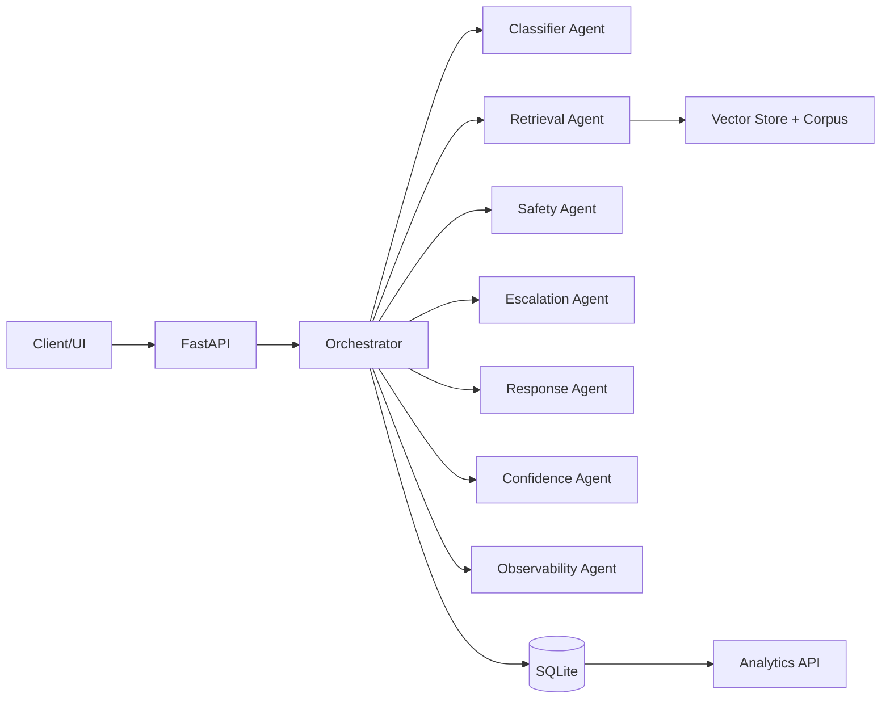
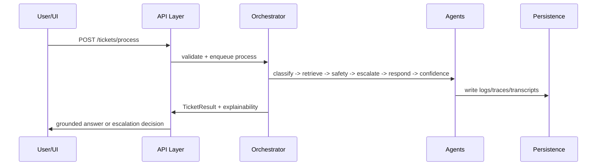

# SentinelSupport Enterprise Architecture

## Layered design

1. API Layer (`FastAPI`): async endpoints, validation, middleware, error handling.
2. Orchestration Layer (`SentinelOrchestrator`): deterministic multi-agent pipeline.
3. Multi-Agent Layer: classifier, retrieval, safety, escalation, response, confidence, observability.
4. Retrieval Layer: corpus ingestion, chunking, vector search, scoring, citation metadata.
5. Safety & Escalation Layer: risk rules, unsupported-query handling, thresholding.
6. Response Layer: grounded-only responses with citations and refusal/escalation fallback.
7. Persistence Layer (`SQLite + SQLAlchemy`): ticket, retrieval, confidence, trace, transcript records.
8. Observability Layer (`structlog`, traces): latency, reasoning, evaluator analytics.
9. Terminal Layer (`Typer + Rich`): simulation, monitoring, CSV export.

## Interaction diagram

## Request lifecycle

## Async execution model

- Endpoint and DB I/O are async (`AsyncSession`).
- Agent stages run as awaitable coroutines.
- Each stage emits trace latency and reasoning keys.
- Batch processing via CLI uses async event loop.
- Design is ready for queue offload (Celery/RQ) without API contract changes.

## Frontend mapping

- AI Decision Pipeline -> `traces`, `classification`, `confidence`.
- RAG Retrieval Insights -> `/retrieval/search`, `citations`, retrieval logs.
- Escalation Queue -> escalation history with reason codes and risk score.
- AI Validation Metrics -> safety flags + confidence breakdown.
- Knowledge Base Sources -> citations (source/doc ids).
- Ticket Risk Analysis -> escalation risk + safety signal summary.
